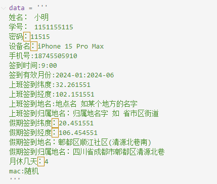
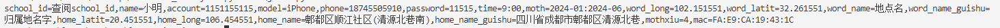
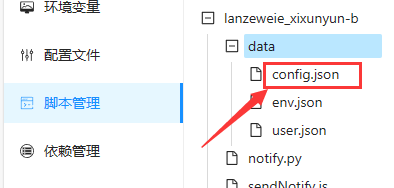
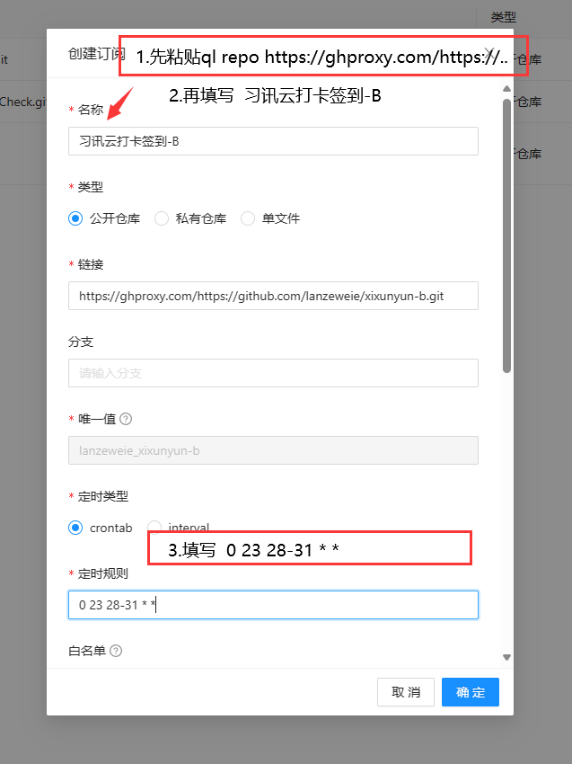
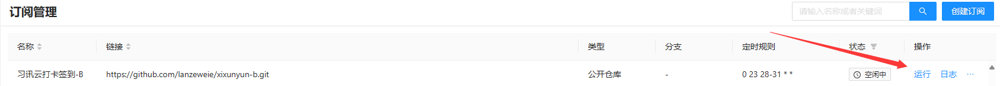
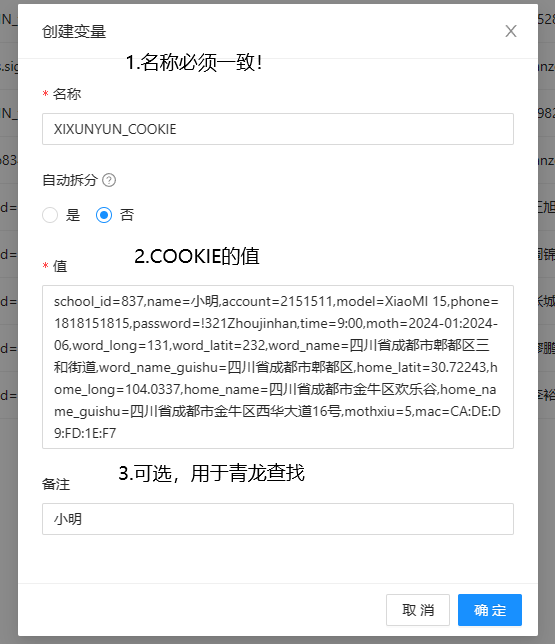
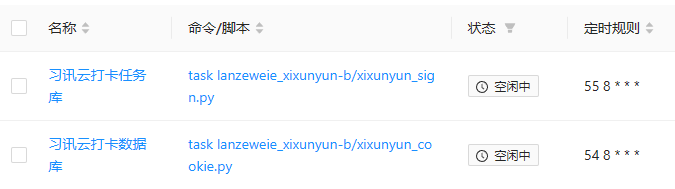
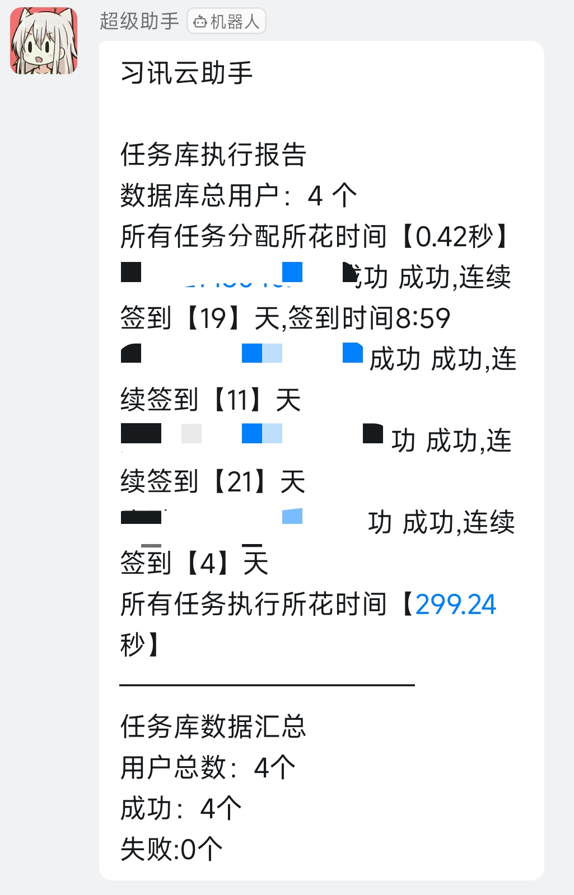
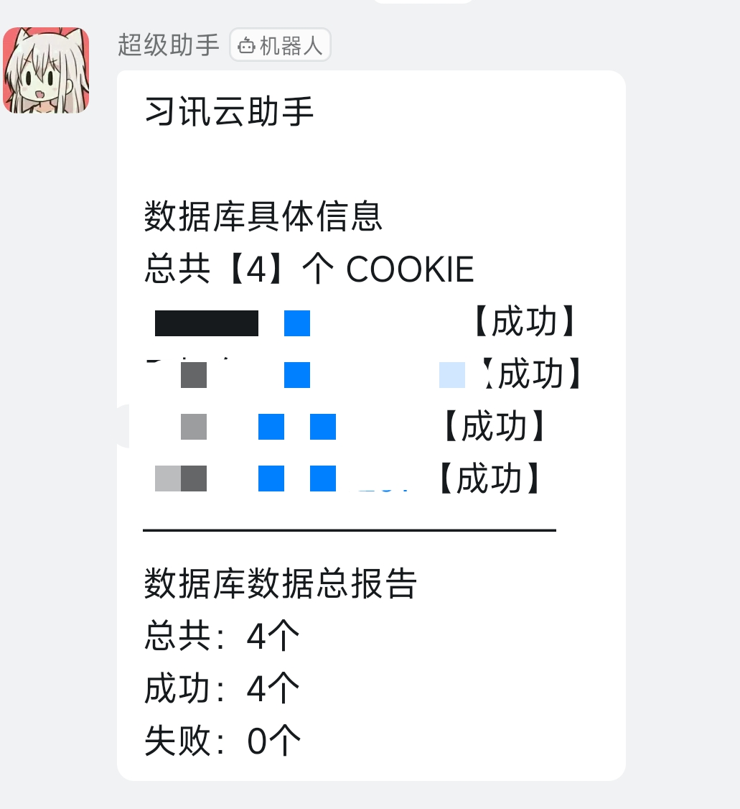

<div align="center">

# -XiXunYun-

_✨ 超多用户实习打卡签到最终解决方案 ✨_

</div>

# 习讯云自动化数据库+习讯云自动化签到任务库
## 介绍
> 掌握用户的一些必要数据后就可以建立成数据库  
使用数据库让自动化签到任务库异步分发出所有签到任务   
支持`大规模数量用户` `不同用户不同时间签到` `模拟不定时提前签到` `支持随机休假``消息推送汇总`   
支持`青龙面板一键订阅`      
~~支持 日志 (日志打印支持，但是打包昨日日志函数BUG导致打包时发生卡循环，又因为青龙面板支持日志保存，所以本地日志功能未修复)~~
不支持 附加图片(我没有这项需求,无法激励我去创作)
本项目出发点是分享与学习，不涉及任何商业盈利项目，本人并且承诺不用于任何商业盈利事件中。   
如有侵权，请联系本人删除此项目。   
任何二创或源代码所造成的损失，与本人无关，本人没有督促或提供帮助。也没有任何收益。  

## 目录
- [-XiXunYun-](#-xixunyun-)
- [习讯云自动化数据库+习讯云自动化签到任务库](#习讯云自动化数据库习讯云自动化签到任务库)
  - [介绍](#介绍)
  - [目录](#目录)
    - [一、自动化数据库](#一自动化数据库)
      - [**从COOKIE中解析用户的必要数据**](#从cookie中解析用户的必要数据)
      - [**数据库建立方式与逻辑**](#数据库建立方式与逻辑)
    - [二、自动化签到任务库](#二自动化签到任务库)
  - [使用方式](#使用方式)
    - [目录结构](#目录结构)
    - [配置填写](#配置填写)
    - [本地运行](#本地运行)
    - [云端执行(青龙面板)  推荐此方法运行](#云端执行青龙面板--推荐此方法运行)
      - [图文教程](#图文教程)
      - [定时任务](#定时任务)
      - [注意事项](#注意事项)
  - [推送、日志](#推送日志)
    - [推送](#推送)
    - [日志](#日志)

### 一、自动化数据库  
#### **从COOKIE中解析用户的必要数据**   
`school_id` `name` `account` `model` `phone` `password` `time` `moth` `word_long` `word_latit` `word_name` `word_name_guishu` `home_latit` `home_long` `home_name` `home_name_guishu` `mothxiu` `mac`  


| 元素 | 值 | 例如 |
| ------- | ------- | ------- | 
| school_id | 学校代码 | school-id.json中查询 |
| name | 姓名 | 小明 |
| account | 学号 | 2132312 |
| model | 设备 | XiaoMi 15 |
| phone | 手机号 | 184818125 |
| password | 密码 | 123456 |
| time | 签到时间 | 9:00 |
| moth | 有效月份 | 2024-01:2024-06 |
| word_latit | 上班纬度 | 30.418515 |
| word_long | 上班经度 | 120.155115 |
| word_name | 上班完整地址 | 成都高新合作街道创新创业孵化基地 |
| word_name_guishu | 上班地址归属地 | 四川省成都市郫都区天骄路368号 |
| home_latit | 放假纬度 | 30.1181888 |
| home_long | 放假经度 | 120.1518545 |
| home_name | 放假完整地址 | 成都市金牛区欢乐谷售票处
| home_name_guishu | 放假地址归属地 | 四川省成都市金牛区西华大道41号 |
| mothxiu | 每月最大月休天数 | 5 |
| mac | 设备物理地址 | CA:DE:D9:FD:1E:F7 |

一个完整的地址 例如：
```
school_id=837,name=小明,account=2151511,model=XiaoMI 15,phone=1818151815,password=!321Zhoujinhan,time=9:00,moth=2024-01:2024-06,word_long=131,word_latit=232,word_name=四川省成都市郫都区三和街道,word_name_guishu=四川省成都市郫都区,home_latit=30.72243,home_long=104.0337,home_name=四川省成都市金牛区欢乐谷,home_name_guishu=四川省成都市金牛区西华大道16号,mothxiu=5,mac=CA:DE:D9:FD:1E:F7   
```
COOKIE 可以通过 `tool/jiexi.py` 快捷把文字解析成COOKIE       
```
python jiexi.py 
```   
      
      

#### **数据库建立方式与逻辑**     
解析COOKIE，分析出用户的必要信息   
使用此信息访问`习讯云`的`api`获得Token，以此验证必要信息是否正确，最后通过验证的信息进行数据库建立  

### 二、自动化签到任务库
_需要依赖数据库运行_  
根据数据库将每一个用户都转为定时任务分发出去  
**重要依据**  
`token` `moth` `mothxiu`  
Token：用户身份    
moth：检查用户是否在有限期内      
mothxiu：一个月的月休上限     
 
**逻辑**   
因为依据数据库，且相信数据库信息为最新，不再验证用户身份    
分析数据库 --> 验证当前用户是否在有效期 --> 概率判断今天类型签到/假期(每个月至少有90%概率休满最大月休息数,节假日强制放假) --> 使用`await`库分配任务[根据`time`定时] --> 达到定时的时间后执行签到


## 使用方式

本地运行与云端运行(青龙面板)区别在于COOKIE的获取方式  
因为是在本地上进行开发，COOKIE的方式设计的需要与云端一样。但是云端(青龙面板)可以使用相同的环境变量读取不同用户且完成多用户模式，而本地不行，为了通用性本地使用的json文本储存来完成多用户的模式。  

采用先建立数据库后执行任务库的顺序使用   
可以使用定时任务，每天检查一次数据库的信息   
在数据库检查完毕后再启动任务库  
例如 数据库程序 运行完后 运行 任务程序     
注意：用户在手机等平台登录会导致数据库Token失效！


### 目录结构
- data                   
  - `config.json`  习讯云配置文件
  - `user.json`   数据库任务程序存放用户的数据 
- tool             
  - `jiexi.py`       快捷将文本格式化为COOKIE
- `loglog.py`  调用的日志模块
- README.md
- requirements.txt
- `school-id.json` 学校代码
- `usr_qian.py` 签到模块
- `usr_record.py` 用户本月状况模块
- `usr_token.py` 通过账号密码获得用户token
- `usr_ua.py` 用户的数据
- `xixunyun_cookie.py` 数据库程序
- `xixunyun_sign.py` 打卡程序

### 配置填写
在`data\config.json` 填写习讯云的配置信息   
``version`` 习讯云版本号  
`from` 来源   
`platform` 系统  
`key` 习讯云打卡经纬度加密公钥，必须进行习讯云认证的公钥加密，否则打卡地址会被拒收。      
如果没有 `key`  无法进行签到功能！！！！！！！！！！！！！   只能建立数据库   
例如：
```
{
    "name":"习讯云配置文件",
    "config":[
        {
            "version": "4.9.7",
            "from":"app",
            "platform": "android",
            "key":"我是公钥，必须是习讯云认证的公钥，可以阅读习讯云网页版源码获得，也可以赞赏此项目获得(联系我)"
        }
    ]
}
```
[联系我获取公钥](https://afdian.com/item/0909c0cedf8411eeb6145254001e7c00)  并非售卖商品，你可以通过阅读 习讯云源代码 获得。    

青龙面板同样修改    
青龙面板->脚本管理->lanzeweie_xixunyun-b->data->config.json    
  

### 本地运行 
```
pip install -r  requirements.txt
```
`data/env.json` 填写用户的COOKIE   


首先建立数据库  
```
python xixunyun_cookie.py
```
建立数据库后执行任务库  
```  
python xixunyun_sign.py
```  

### 云端执行(青龙面板)  推荐此方法运行        
`青龙面板`安装方式请自行百度，安装简单。别傻乎乎在本地上安装青龙面板，自备服务器    

**使用教程**：  
1.订阅仓库 
青龙面板->订阅管理->创建订阅->复制粘贴到名称
```
ql repo https://github.com/lanzeweie/xixunyun-b.git "xixunyun_cookie|xixunyun_sign" "" "^usr_.*|data/|sendNotify" "" "json|py" 
```
如果失败则使用国内加速
```
ql repo https://ghproxy.com/https://github.com/lanzeweie/xixunyun-b.git "xixunyun_cookie|xixunyun_sign" "" "^usr_.*|data/|sendNotify" "" "json|py" 
```
最后再次在名称填写 习讯云打卡签到-B 即可 

定时更新规则  
一个月最后一天23点更新   
`0 23 28-31 * *`

最后点击运行即可   
*需要打开自动创建定时任务*  

2.配置环境变量   
青龙面板->环境变量->新建变量   
建立环境变量  `XIXUNYUN_COOKIE`  
填写 COOKIE 即可，多个用户重复建立即可 

3.注意事项  (先尝试运行，出问题在手动安装)没有此库无法进行节假日休息    
注意：青龙面板可能没有`chinese_calendar`库，需要手动安装    
使用脚本安装 `chinese_calendar` 即可     
``` pip install chinese_calendar ```   

#### 图文教程    
1.订阅  
    
  
2.新建变量  
  

#### 定时任务

`xixunyun_sign.py` 是依据 `xixunyun_cookie.py` 的数据，所以 `xixunyun_cookie.py` 数据必须是最新，如果无法保证 数据永远最新，请让 `xixunyun_sign.py` 执行之前运行 `xixunyun_cookie.py`    
例如：
提前1分钟运行`xixunyun_cookie.py`  再运行 `xixunyun_sign.py`  
  

#### 注意事项  
一切都是为了模拟真实用户
_如果用户的签到时间**小于**任务库分配任务的时间则会立即执行_   
_定时时间有小概率事件发生随机提前【1-5分钟】_  
_有小概率发生不会休满一个月最大月休数_  


## 推送、日志 
变量 `bot_message` 存放推送的信息   
   
      

### 推送
(青龙面板)      
直接配置青龙面板本身的机器人推送即可  

### 日志
(青龙面板)   
日志管理   

### License

本项目采用 [Creative Commons](./LICENSE) 许可证进行授权。具体条款如下：

- **署名（BY）**：您必须给予适当的署名，提供指向许可证的链接，并说明是否进行了更改。您可以以任何合理的方式做到这一点，但不得以任何方式暗示授权人对您或您的使用方式的支持。
  
- **非商业性（NC）**：您不得将本作品用于商业目的。
  
- **禁止演绎（ND）**：如果您重混、转换或以其他方式构建本作品，您不得分发修改后的作品。

如需了解更多详细信息，请查看 [Creative Commons](./LICENSE)
